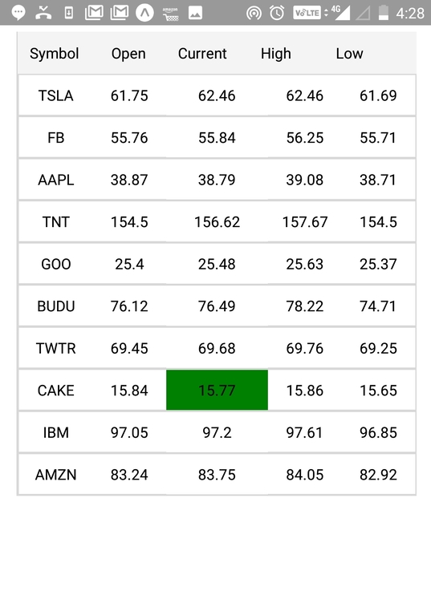

# StockMarket
Real time stock market application with React Native, Node.js, and Socket.io

# Live Demo



## Getting Started

First, head over to the [Expo installation guide](https://docs.expo.io/versions/latest/introduction/installation.html) to get your development environment set up.

## Requirements

- NodeJS
- Expo

## Setup instructions

```
git clone git@github.com:ravinder3128/StockMarket.git
```

## Server 

There is a server that manage stock data using socket.io. The data is only for demo purpose .

```
cd StockMarket/Backend
npm install
npm start
```

## Application 

Replace SocketEndpoint URL with your own, if you want to run the backend locally!

```
StockMarket/App/Feed.js
Change SocketEndpoint 
```

There is a server that manage stock data using socket.io. The data is only for demo purpose .

```
cd StockMarket/App
npm install
npm start
```

# Preview your project
Open Expo Client on your device. Scan the QR code printed by npm start with Expo Client (Android) or Camera (iOS). You may have to wait a minute while your project bundles and loads for the first time.


